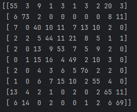
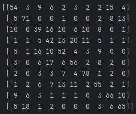
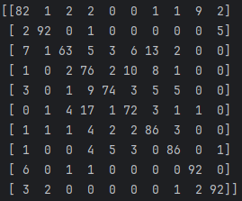
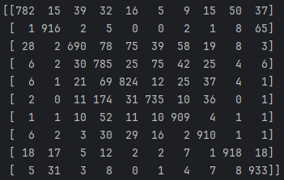

# CIFAR-10-classification

## Group Information

- Gabriel Dubois [40209252]
- Xavier Guertin [40213525]

## Project Overview

This project is a classification model for the CIFAR-10 dataset. The steps include analyzing the dataset, preprocessing the images, and building four models: Naive Bayes, Decision Tree, Multi-Layer Perceptron, and Convolutional Neural Network using Python and PyTorch.

## **Repository Structure**
- `download.py`: Downloads the CIFAR-10 dataset and separates the necessary training and testing data.
- `feature_extraction.py`:Pre-processes images (resize, normalize) and extracts 512-dimensional feature vectors using a pre-trained ResNet-18 model. PCA is applied to reduce the feature vectors to 50 dimensions.
- `naive_bayes.py`:Implements Gaussian Naive Bayes classifiers using both custom code and Scikit-learn.
- `decision_tree.py`:Implements Decision Tree classifiers using both custom code and Scikit-learn.
- `mlp.py`:Defines and trains a Multi-Layer Perceptron (MLP) using PyTorch.
- `cnn.py`:Implements and trains a VGG11-based Convolutional Neural Network (CNN) using PyTorch.
- `main.py`: Script to execute all parts of the project, from data processing to model evaluation.
- `models/`:Contains all saved models as well as variants of the main models.

## **Installation and Setup**

1. **Clone the repository:**

   ```bash
   git clone https://github.com/Adissuu/CIFAR-10-classification.git
   cd CIFAR-10-classification

   ```

2. **Install dependencies:**

   ```
   collections
   numpy
   sklearn
   torch
   torchvision
   ```

3. **Run the code**
   - **Train the models**:
      - Delete or save the models under `models/` in another folder.
      - Run `python main.py`
   - **Run the models**:
      - Run `python main.py`

   Please note: The entire training process takes around 50 minutes on a NVDIA RTX 3070 GPU with cuda activated.

## Example of output
Starting Image Classification Project...\
Using device: NVIDIA GeForce GTX 1080 Ti\

Running Naive Bayes...\
Files already downloaded and verified\
Files already downloaded and verified\
Classes:  {0: 0, 1: 0, 2: 0, 3: 0, 4: 0, 5: 0, 6: 0, 7: 0, 8: 0, 9: 0}\
Classes:  {0: 0, 1: 0, 2: 0, 3: 0, 4: 0, 5: 0, 6: 0, 7: 0, 8: 0, 9: 0}

Running Decision Tree...\
Files already downloaded and verified\
Files already downloaded and verified\
Classes:  {0: 0, 1: 0, 2: 0, 3: 0, 4: 0, 5: 0, 6: 0, 7: 0, 8: 0, 9: 0}\
Classes:  {0: 0, 1: 0, 2: 0, 3: 0, 4: 0, 5: 0, 6: 0, 7: 0, 8: 0, 9: 0}

Training Custom Decision Tree...\
Evaluating Custom Decision Tree...\
Training Scikit-Learn Decision Tree...\
Evaluating Scikit-Learn Decision Tree...

Custom Tree Results:\
Accuracy: 0.579\
Precision: 0.5781880341060952,\
Recall: 0.579,\
F1-Score: 0.5779770982129772\
Confusion Matrix:


Scikit-Learn Tree Results:\
Accuracy: 0.578\
Precision: 0.5766507123337619,\
Recall: 0.578,\
F1-Score: 0.576848981336209\
Confusion Matrix:


Running Multi-Layer Perceptron...\
Files already downloaded and verified\
Files already downloaded and verified\
Classes:  {0: 0, 1: 0, 2: 0, 3: 0, 4: 0, 5: 0, 6: 0, 7: 0, 8: 0, 9: 0}\
Classes:  {0: 0, 1: 0, 2: 0, 3: 0, 4: 0, 5: 0, 6: 0, 7: 0, 8: 0, 9: 0}

Training MLP...\
Epoch 1/10 completed.\
Epoch 2/10 completed.\
Epoch 3/10 completed.\
Epoch 4/10 completed.\
Epoch 5/10 completed.\
Epoch 6/10 completed.\
Epoch 7/10 completed.\
Epoch 8/10 completed.\
Epoch 9/10 completed.\
Epoch 10/10 completed.\
Evaluating MLP...\
Evaluation Results:\
Accuracy: 0.815\
Precision: 0.8208936637004576,\
Recall: 0.815,\
F1-Score: 0.8148006100550842\
Confusion Matrix:


Running Convolutional Neural Network...\
Files already downloaded and verified\
Files already downloaded and verified

Training VGG11...\
Epoch 1/10 completed.\
Epoch 2/10 completed.\
Epoch 3/10 completed.\
Epoch 4/10 completed.\
Epoch 5/10 completed.\
Epoch 6/10 completed.\
Epoch 7/10 completed.\
Epoch 8/10 completed.\
Epoch 9/10 completed.\
Epoch 10/10 completed.\
Evaluating VGG11...\
Evaluation Results:\
Accuracy: 0.8402\
Precision: 0.8460612204660655,\
Recall: 0.8402,\
F1-Score: 0.8404637910881213\
Confusion Matrix:


--- Model Comparisons ---

Naive Bayes Results:\
Custom GNB Accuracy: 0.7790\
Custom GNB Precision: 0.7832\
Custom GNB Recall: 0.7790\
Custom GNB F1-Score: 0.7785\
Scikit-Learn GNB Accuracy: 0.7790\
Scikit-Learn GNB Precision: 0.7832\
Scikit-Learn GNB Recall: 0.7790\
Scikit-Learn GNB F1-Score: 0.7785

Decision Tree Results:\
Custom Tree Accuracy: 0.5790\
Custom Tree Precision: 0.5782\
Custom Tree Recall: 0.5790\
Custom Tree F1-Score: 0.5780\
Scikit-Learn Tree Accuracy: 0.5780\
Scikit-Learn Tree Precision: 0.5767\
Scikit-Learn Tree Recall: 0.5780\
Scikit-Learn Tree F1-Score: 0.5768

MLP Results:\
Accuracy: 0.8150\
Precision: 0.8209\
Recall: 0.8150\
F1-Score: 0.8148

CNN Results:\
Accuracy: 0.8402\
Precision: 0.8461\
Recall: 0.8402\
F1-Score: 0.8405

--- Summary of Time Taken ---\
Time Taken for Naive Bayes: 0.81 minutes\
Time Taken for Decision Tree: 3.52 minutes\
Time Taken for MLP: 0.80 minutes\
Time Taken for CNN: 46.78 minutes\
Total Time Taken: 51.90 minutes
